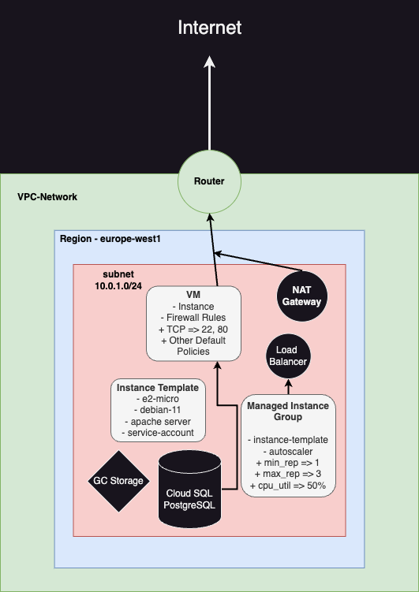

# Deploying a secure and scalable web app
----

## Architecture

----

Bu proje Terraform kullanılarak, Google Cloud resource'ları ile yapılmıştır.

Google Cloud Platform'unda kullanılan resource'lar:

- **VPC-Network**
  - Europe-west1 Region'ında **Subnet**
  - **Cloud Router**
  - **NAT Gateway**
- **Service Account** ve **IAM** Rolleri
  - Cloud SQL Admin ve Client
  - Compute Admin ve Network User
  - Service Account User ve Networking Admin
  - Storage Admin
- **Instance Template** => Service Account ile eşleştirilmiş
- Instance Template kullanılarak yaratılan **Managed Instance Group (MIG)**
- Proje web'de görüntülenebilmesi için basit bir **Apache Server** ve **Html** dosyası
- Kolayca ölçekleyebilmek için **Autoscaler** => CPU fazla kullanıldığında replica sayısını arttırmak için
- Instance'lara gelen trafiği daha verimli ve iyi bir şekilde dağıtmak için **Load Balancer**
- Uygulama kolay bir şekilde monitor edilmesi için CPU kullanımın fazla olduğu durumlarda (>80%) **Alarm**
- Veritabanı olarak VM ile **Private IP** üzerinden haberleşen **CloudSQL (PostgreSQL)**
- Proje'deki state dosyalarını Cloud üzerinde saklamak için private **Bucket** oluşturuldu, **object versioning** özelliğiyle

----

Screenshot of Apache Server
----

----